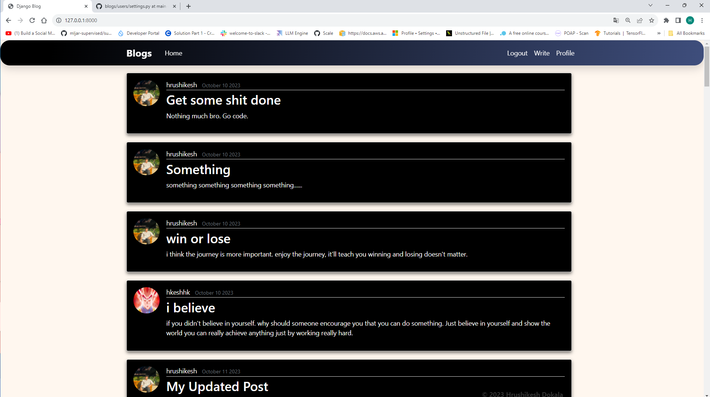
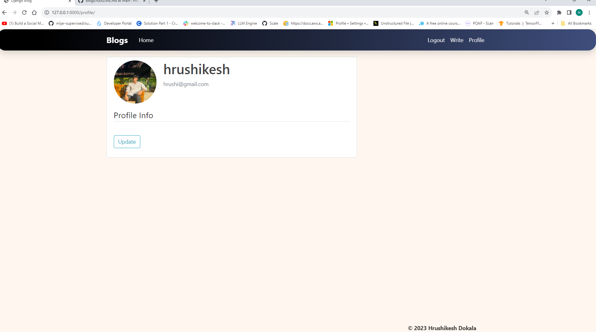

# Blogging Website

## Overview

This Readme provides an overview of the Django application(Blogging Website).

## Prerequisites

Before you begin working on any Django project, make sure you have the following prerequisities installed:

- Python
- Django
- Other dependencies

## Installation

Create a virtual environment (recommended):

   ```bash
   python -m venv venv
   ```

Activate the virtual environment:

   - On Windows:

     ```bash
     venv\Scripts\activate
     ```

   - On macOS and Linux:

     ```bash
     source venv/bin/activate
     ```

Install dependencies:

``` bash
  pip install -r requirements.txt 
```

Apply database migrations:

   ```bash
   python manage.py migrate
   ```

Create a superuser (admin) account:

   ```bash
   python manage.py createsuperuser
   ```

Start the development server:

   ```bash
   python manage.py runserver
   ```

## Everything that this application contains:

- Blogs
- UserAuth
- CRUD 
- Profile Management



- You can apply CRUD operations for both the blogs and the user profile.

## Contact

Reach out :
[LinkedIn](https://www.linkedin.com/hrushikeshdokala)

[X](https://www.x.com/hrushikeshhhh)